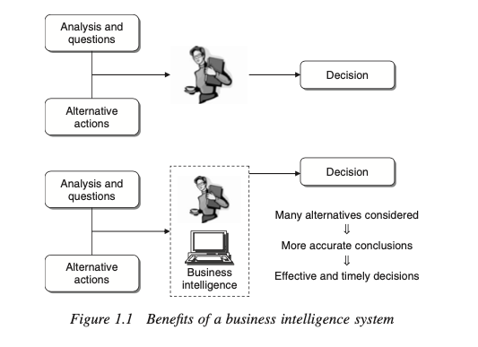

# **Understanding Business Intelligence (BI)**

## **Key Concepts**

- **Vast Data Availability:** In our digital age, organizations, whether public or private, gather and store immense volumes of diverse data, ranging from online activities to medical test results.
- **Decision-Making:** Daily decisions within these organizations vary in their impact and urgency, affecting different levels of hierarchy. The capability to make informed decisions quickly is crucial for maintaining competitiveness and operational efficiency.

## **Business Intelligence Explained**

**Business Intelligence** (BI) is a toolset designed to transform raw data into actionable insights, aiding decision makers in navigating complex situations through:
- **Mathematical Models and Analytical Methodologies:** These help analyze the data more deeply to produce reliable and strategic insights.

## **Real-World Examples**

### *Example 1.1 - Mobile Phone Industry Retention*
- **Situation:** A marketing manager notices a high customer turnover.
- **Challenge:** Selecting 2,000 customers from 2 million to target for a retention campaign to minimize customer churn.
- **BI Utility:** Advanced mathematical models predict which customers are likely to leave, optimizing campaign effectiveness.

### *Example 1.2 - Logistics Planning*
- **Situation:** A logistics manager needs to develop a medium-term plan involving numerous facilities and suppliers.
- **Complexity:** The plan includes demand allocation, procurement, production planning, and distribution.
- **BI Utility:** Optimization models help tackle the complexity, ensuring efficient logistics operations.

## **Benefits of BI Systems**

- **Effective Decisions:** BI tools enable decision-makers to utilize rigorous analytical methods, leading to more reliable and impactful decisions.
- **Timely Decisions:** In fast-paced markets, the ability to quickly respond to changes is critical. BI systems enhance this responsiveness, improving the organization's agility and success potential.

**Figure 1.1** outlines the transformation from questions and analyses to more precise actions and timely decisions, illustrating the tangible benefits of implementing BI systems in any organization.

---

This summary aims to simplify the concepts and highlight how BI can be practically applied to enhance decision-making processes in complex environments, making it accessible to beginners. Let me know if you'd like further refinements or additional details!